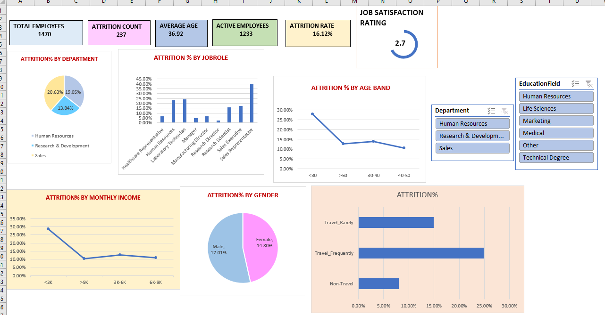
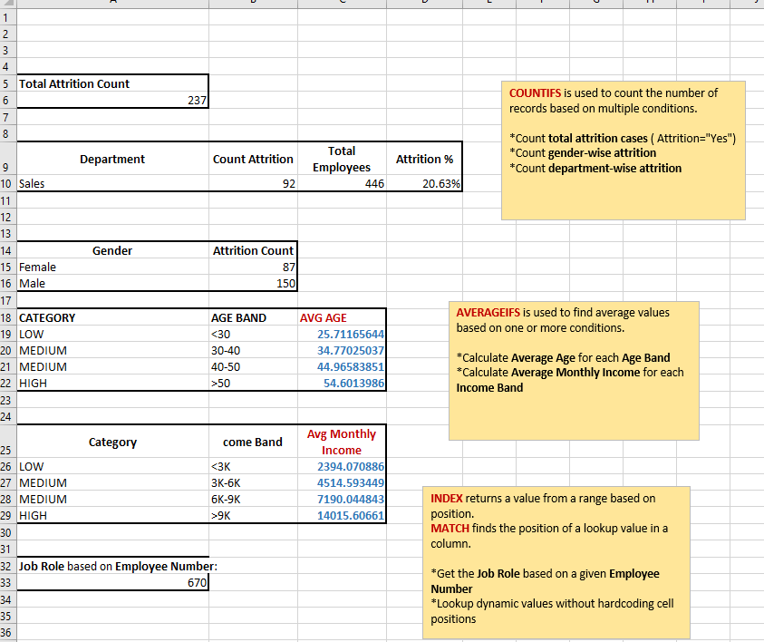

# HR Attrition Analysis Using Excel 

## Objective

This project explores employee attrition trends using Excel. It includes a full dashboard with charts and KPIs, along with formula-driven analysis to identify key patterns in attrition based on gender, department, age band, and income band.

---

##  Files Included

- `HR_Attrition_Dashboard_Excel.xlsx`: Pivot table dashboards and slicer-enabled visuals.
- `HR_Attrition_Functions_Excel.xlsx`: Formula-based analysis using COUNTIFS, AVERAGEIFS, LOOKUP, INDEX+MATCH.

---

## 📊 Dashboard Preview

---

## 🔍 Functions Logic Breakdown

This Excel sheet uses the following:

### ✅ COUNTIFS
Used to count records matching multiple criteria:
- Total attrition count
- Gender-wise attrition
- Department-wise attrition

### ✅ AVERAGEIFS
Calculates average values based on conditions:
- Average Age per Age Band (`<30`, `30-40`, `40-50`, `>50`)
- Average Monthly Income per Income Band (`<3K`, `3K-6K`, `6K-9K`, `>9K`)

### ✅ INDEX + MATCH
Used for dynamic lookups:
- Get Job Role based on Employee Number
- Avoids hardcoding cell positions (better than VLOOKUP)

### ✅ LOOKUP
Used to assign bands (e.g., Income Band: Low, Medium, High) based on value ranges.

---

## 📸 Functions Table Preview

---

## 🧠 Insights Extracted

- Highest attrition from the Sales department
- Male employees had higher attrition rates
- Employees with lower income bands tend to show higher attrition
- Most attrition happens between age groups `30-40` and `40-50`

---

## ✅ Skills Demonstrated

- Excel Pivot Tables & Charts
- Logical & Lookup Formulas (COUNTIFS, INDEX/MATCH, LOOKUP)
- Data segmentation using bands
- Dashboard storytelling
